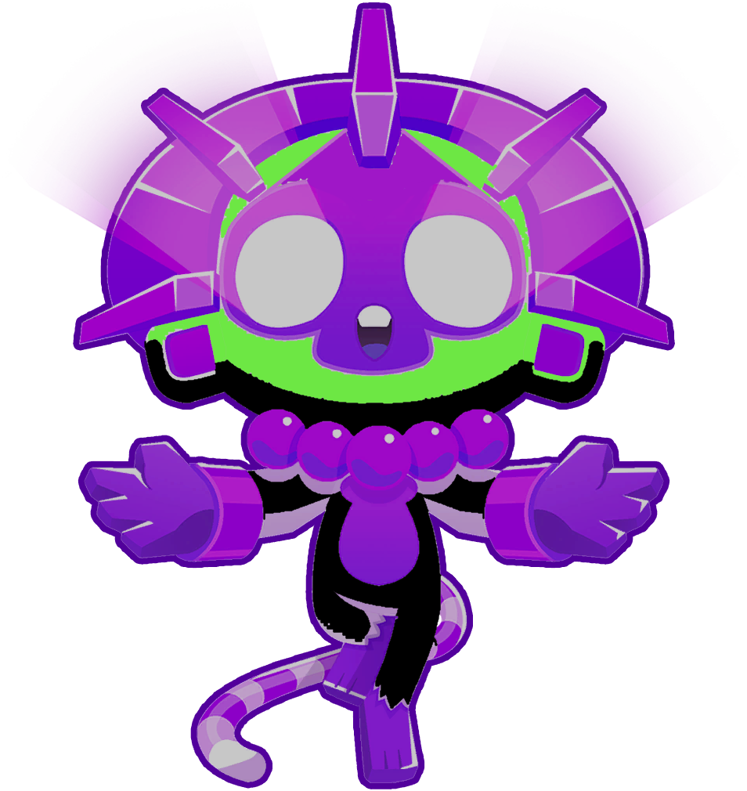

<h1 align="center">Firework Monkey</h1>

### A test mod originally based off doombubbles Card Monkey tower using BTD Mod Helper.

    
    

* This is a test tower, it will eventually become a Firework Monkey, that absorbs surrounding towers and turns their weapons into fireworks

